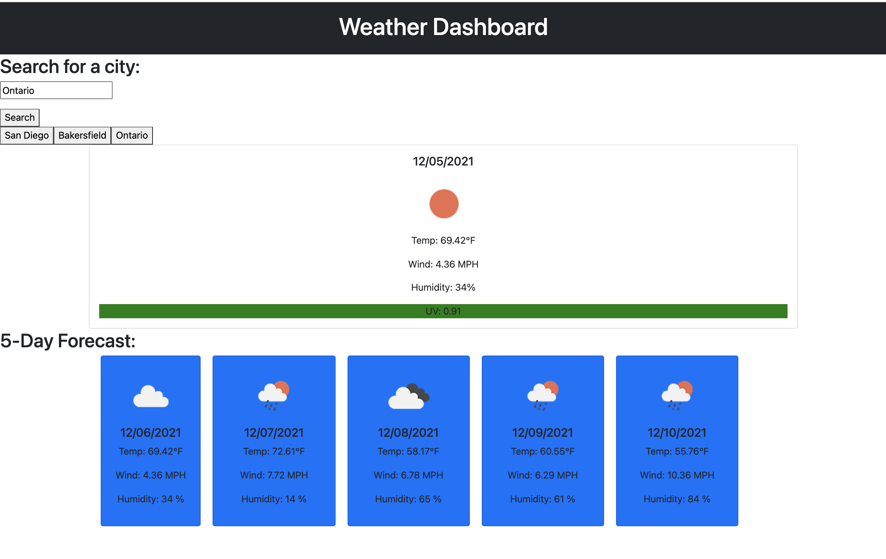

# weather-dashboard

This is a weather dashboard application. Users can enter a city and the forecast details will display the current day and the future forecast for the next five days. Users can observe temperature, wind speed, and humidity. The city will be added to the search history so users can toggle back and forth between previous city searches. The UV index will be color coded according to its value. Green will display for UV indexes between 0 and 2 (low), yellow for 3-5 (moderate), and orange for 6-7 (high/severe). Weather icons will also display for each card.  

# Screenshot

# Links
https://annielnguyen.github.io/weather-dashboard/
https://github.com/annielnguyen/weather-dashboard

# Languages and Technologies Used
HTML,CSS, JQuery, Bootstrap

# Contact Creator
Annie Nguyen -- UCLA Coding Bootcamp
anguyen.aln@gmail.com 
